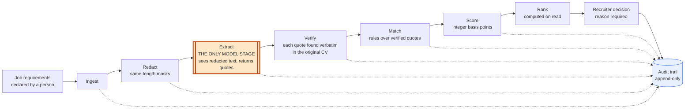

# Explainable ATS

Screens a CV against a role and explains every placement with the exact sentences from the CV that earned it: the model quotes, deterministic code judges, and a recruiter decides.

<!-- SCREENSHOT: candidate detail view (score, verdicts, quoted evidence) goes here -->
<!-- DEMO_VIDEO: 60–90s screen recording of the app running locally goes here -->

## Key facts

- **What it does.** A person declares a role's requirements, each with a weight and an essential-or-desirable flag. The system reads a CV against them, ranks the candidates and shows, for every verdict, the quoted passage behind it.
- **The design principle.** *The model quotes, deterministic code judges.* A language model is used in exactly one stage, extraction. It sees only redacted text, and it can only return quotes. It cannot give a verdict or a score.
- **Nothing counts until it is checked.** Every quote is looked up verbatim in the original CV. A quote that isn't there is stored as rejected and never shown or scored.
- **Everything after extraction is reproducible.** Matching is rule-based, scores are integers you can recompute by hand, rankings are derived on every read, and an append-only audit trail records each step.
- **Stack.** Node 24 and TypeScript (run directly, no build step), Express 5, SQLite or PostgreSQL behind one interface, React 19 with Vite and Tailwind. The server has three runtime dependencies: `express`, `pg` and the Anthropic SDK.
- **Tests.** `npm test` reports 689 passing and 0 failing (500 server, 189 web). Five of those are helper modules the runner counts, so there are 684 test cases. [What they protect](docs/TESTING.md).
- **Where it stands.** A portfolio project. The demo uses the deterministic mock extractor, a keyword matcher, in place of the model, on five invented candidates. The Anthropic adapter exists and has not been run against the real API. There is no evaluation set yet. See [Limitations](#limitations).

## Run it locally

**Prerequisites:** Node.js 24 or newer (the `engines` field in `package.json`). Nothing else — no
database, API key or account.

```bash
npm run demo
```

Run that from the repository root. It installs the dependencies, builds the dashboard and starts the
app in demo mode. When it prints `Open http://localhost:3200/#/demo`, open that address.

One terminal is enough: the server serves the dashboard on the same address as the API. The demo
runs on five invented candidates, in a private in-memory session per browser, with the deterministic
mock extractor — so **no API key is needed**, and no real applicant data is involved. The full
recruiter application (sign-in, database, seeded data) is described under
[Running the full application](#running-the-full-application).

## How it works



The orange box is the only place a model runs. Every other box is plain code. In that stage the adapter **forces the `record_evidence` tool**, so the provider can answer only with a list of quotes, and it is given redacted resume text only.

| Stage | What it does | File |
|---|---|---|
| Ingest | Stores the CV text and its redacted copy; refuses empty or oversized input; the same document twice is one resume | `server/src/agent/ingest.ts` |
| Redact | Masks protected attributes with `█` runs of equal length, so offsets match in both copies | `server/src/agent/redact.ts` |
| Extract | Sends the requirements and the redacted text to the provider, which must answer through a forced `record_evidence` tool call | `server/src/agent/extract.ts`, `server/src/agent/extractionSchema.ts` |
| Verify | Looks each quote up in the original text; rejects anything not found or overlapping a mask | `server/src/agent/verifyEvidence.ts` |
| Match | One verdict per requirement from how many of its significant terms the verified quotes contain | `server/src/agent/matchRules.ts`, `server/src/agent/match.ts` |
| Score | `floor(Σ weight × verdict points / Σ weight)`, with contributions that sum exactly to it | `server/src/agent/score.ts` |
| Rank | Four tiers, then score; derived on every read and never stored | `server/src/agent/rankRules.ts`, `server/src/agent/rank.ts` |
| Decide | A recruiter records `shortlist`, `reject` or `hold` with a written reason, once per assessment | `server/src/handlers/evaluations.ts` |

## Terms and what the screen says

The code uses one set of words and the screens use another. This is the mapping (the screen wording is in `web/src/copy.ts`).

| Code | Meaning | The screen says |
|---|---|---|
| `met` | The quoted evidence covers at least 75% of what the requirement asks for | **Met** |
| `partial` | It covers at least 35% but less than 75% | **Partly met** |
| `not_met` | A relevant quote was found and it falls short | **Does not meet** |
| `unclear` | No verified quote at all. The CV is silent either way | **Not demonstrated** |
| `qualified` | Every must-have is `met` | **Meets every must-have** |
| `needs_review` | No must-have failed, but at least one was `unclear` | **Worth a look** |
| `gated` | A must-have was addressed and is `partial` or `not_met` | **Missing an essential** |
| `not_evaluated` | No scored evaluation for this job | **Not assessed yet** |
| `shortlist` | Decision: move the candidate forward | **Advance** |
| `hold` | Decision: park for a closer look | **Review** |
| `reject` | Decision: do not take further | **Reject** |
| `must_have` / `nice_to_have` | A requirement's kind | **Essential** / **Desirable** |
| `scoreBasisPoints` | The score as an integer from 0 to 10000 | A whole percent (7142 shows as 71%) |
| evaluation | One assessment of one candidate against one job | **Assessment** |

`not_met` and `unclear` are different on purpose. "The CV says something that falls short" and "the CV says nothing" are different facts about a person, and the screens never show both as "no".

## Architecture

Two packages: `server/` (Express, the pipeline, two database drivers) and `web/` (React, one bundle served by the same origin as the API). Routes stay thin, handlers hold request logic, and the pipeline in `server/src/agent/` holds the business rules. One built front end serves two server modes, `app` and `demo`.

The detail, with a diagram of each stage's inputs and outputs, the data model, request flows and the reasons behind each design choice, is in [docs/ARCHITECTURE.md](docs/ARCHITECTURE.md).

## Explainability and evidence

- **Every verdict shows its quote.** Each requirement on a candidate's page carries its verdict, a confidence (`high`, `medium` or `low`), a rationale that states exactly what was counted, and the verified passages with their positions in the CV.
- **Only verified passages are ever sent to the browser.** Rejected quotes are kept in the audit trail so a fabrication stays visible, but `server/src/handlers/evaluations.ts` never sends them.
- **The audit trail tells the whole story.** One ordered history merges the resume's events (ingestion, redaction) with the evaluation's (extraction, verification, matching, scoring, the decision). The score event carries every input, so the number can be recomputed from the trail alone.
- **A ranking explains itself.** Each entry carries a sentence: *"Scored 71% and meets 1 of 2 must-haves. The evidence found does not demonstrate "PostgreSQL". Placed below every candidate who meets all of them, however high that score is — the score itself is unchanged."*

## Privacy and redaction

The model is given `redacted_text` and never the original, so a protected attribute can't influence extraction: it isn't in the input. That is a structural guarantee, not an instruction the model could ignore.

- **What is masked.** Emails and phone numbers, labelled fields (date of birth, age, nationality, marital status, gender, address, photo, religion, name), and any names the caller supplies. The categories are `name`, `age`, `gender`, `nationality`, `photo`, `address`, `marital_status`, `religion`, `contact` and `other`.
- **How.** Each span becomes a run of `█` of exactly the same length. Labels stay, so a recruiter can see *what* was removed. Offsets are identical in both copies, so a position the model reports against the redacted text indexes the original directly.
- **What is stored.** A category and a character range for each span. There is no column that could hold the value.
- **What reaches the browser.** Categories and a count, never values. A candidate's name is never an input to scoring or ranking.
- **A quote that overlaps a mask is refused**, even when the text is genuinely in the CV. The model was never shown it, so producing it means a guess or a leak.

Redaction is pattern-based and tuned for the synthetic dataset. It is a demonstrable boundary, not a general-purpose PII scrubber for real resumes.

## Scoring

```
score = floor( Σ (weight × verdict points) / Σ weight )     met = 10000, partial = 5000, not_met = 0, unclear = 0
```

The demo role is *Senior Backend Engineer*, with three requirements:

| Requirement | Kind | Weight |
|---|---|---|
| Node.js | must-have | 3 |
| PostgreSQL | must-have | 2 |
| Mentoring | nice-to-have | 2 |

The weights add up to 7. Here are three of the five candidates, as the running system scores them.

**Devi** scores 71% and is qualified.

| Requirement | Quote found in the CV | Verdict | Points earned |
|---|---|---|---|
| Node.js | "Designed and shipped production Node.js services behind a payments API." | `met` (4 of 4 terms) | 3 × 10000 = 30000 |
| PostgreSQL | "Running PostgreSQL at scale for a multi-tenant billing system." | `met` (3 of 3 terms) | 2 × 10000 = 20000 |
| Mentoring | none | `unclear` | 2 × 0 = 0 |

`(30000 + 20000 + 0) / 7 = 7142.857…`, and the floor is **7142** (71%). The per-requirement shares are 30000/7 = 4285, 20000/7 = 2857 and 0, which add up to 7142 with nothing left over.

**Marcus** also scores 7142. His Node.js and Mentoring are `met`, but his only PostgreSQL quote is "Used PostgreSQL for a final-year university project.". It contains one of the three terms (`postgresql`, `run`, `scale`), so the verdict is `not_met`. `(30000 + 0 + 20000) / 7` is again 7142. Because a must-have was addressed and fell short, he is **gated**: placed *below* Devi with exactly the same score.

**Ines** scores 5714. Node.js is `met` and her Mentoring quote ("Mentored a junior developer during onboarding.") covers two of four terms, so it is `partial`. Her CV says nothing about PostgreSQL, so that is `unclear`: `(30000 + 0 + 10000) / 7 = 5714.28…`, so **5714**. The raw shares are 4285 (remainder 5), 0 and 1428 (remainder 4), which add up to 5713, one short. The leftover point goes to the largest remainder, so the contributions are **4286, 0 and 1428**, which add up to 5714.

The resulting order:

| Rank | Candidate | Score | Tier | Why |
|---|---|---|---|---|
| 1 | Rowan | 100% | Meets every must-have | Every requirement `met` |
| 2 | Devi | 71% | Meets every must-have | Both essentials `met` |
| 3 | Ines | 57% | Worth a look | PostgreSQL is `unclear`, so it is unresolved, not failed |
| 4 | Marcus | 71% | Missing an essential | The PostgreSQL evidence fell short |
| — | Toby | — | Not assessed yet | Received but not yet assessed |

Ines ranks above Marcus although her score is lower, because `needs_review` sits above `gated`. The tiers and their order are in [docs/ARCHITECTURE.md](docs/ARCHITECTURE.md#how-ranking-works).

## API

All routes are under `/api`. Errors share one envelope, `{ "error": { "code", "message" } }`, with the codes `VALIDATION_ERROR` (400), `UNAUTHORIZED` (401), `FORBIDDEN` (403), `NOT_FOUND` (404), `CONFLICT` (409), `INVALID_STATE` (409), `PROVIDER_UNAVAILABLE` (502), `RATE_LIMITED` (429) and `INTERNAL_ERROR` (500).

### Real application (`APP_MODE=app`)

| Method and path | Access | Purpose |
|---|---|---|
| `GET /api/health` | Public | Liveness, the `mode`, and whether the database is reachable. Never reports a secret |
| `POST /api/auth/login` | Public, 10 per minute | Sign in with the operator password |
| `POST /api/auth/logout` | Anyone | End the session (always succeeds) |
| `GET /api/auth/session` | Public | Whether there is a session; answers "no" rather than 401 |
| `GET /api/jobs` | Session | The roles, with counts |
| `GET /api/jobs/:jobId` | Session | One role and its requirements |
| `GET /api/jobs/:jobId/ranking` | Session | The finished ranking: positions, ranks, tiers and sentences |
| `GET /api/evaluations/:evaluationId` | Session | One candidate against one role: verdicts, quotes, score |
| `GET /api/evaluations/:evaluationId/audit` | Session | The ordered history of that assessment |
| `POST /api/evaluations/:evaluationId/decision` | Session + CSRF token | **The single write route.** Body `{ outcome, reason }` |

Every route except health and the three sign-in routes sits behind the session gate. There is no anonymous read of real data.

`POST /api/evaluations/:evaluationId/decision` takes `outcome` (`shortlist`, `reject` or `hold`) and a `reason` of 10 to 2000 characters. It returns 201 with the decision and the resulting evaluation. It refuses with 403 (no CSRF token), 400 (bad outcome or short reason), 409 (not yet scored, superseded by a newer assessment, or already decided) and 404.

No route uploads or accepts a resume, creates a job, or runs extraction. Resumes enter through the seeder (`npm run seed:demo`) and tests.

### Public demo (`APP_MODE=demo`)

The demo registers health and the visitor-scoped routes below, and nothing else. They are anonymous, and each is answered from the visitor's own private in-memory database.

| Method and path | Purpose |
|---|---|
| `POST /api/demo/session` | Start a session, or resume the one the cookie names |
| `GET /api/demo/session` | Is there one? Never an error |
| `POST /api/demo/session/reset` | Restore this visitor's copy of the dataset |
| `DELETE /api/demo/session` | End this visitor's session |
| `GET /api/demo/session/jobs`, `.../jobs/:id`, `.../jobs/:id/ranking` | The dashboard's reads |
| `GET /api/demo/session/evaluations/:id`, `.../audit` | One assessment and its history |
| `GET /api/demo/session/evaluations/:id/resume` | The **redacted** resume text, and nothing else |
| `POST /api/demo/session/evaluations/:id/decision` | A demo decision, saved only to this visitor's session |

A demo decision is recorded as the fixed actor `demo-visitor` and reuses the recruiter's decision logic (same outcomes, same reason rule, same one-per-assessment rule), but looks the evaluation up only in the caller's own database.

## Security

- **Sign-in.** One operator and one shared password. The password is checked against a scrypt hash (`OPERATOR_PASSWORD_HASH`, made with `npm run hash-password`). There is no built-in default password, so an unconfigured server answers 401 to everything protected.
- **Sessions.** An opaque random token in an `ats_session` cookie (`HttpOnly`, `SameSite=Strict`, `Secure` unless `COOKIE_SECURE=false`). The server stores only its SHA-256. Lifetime is `SESSION_TTL_HOURS` (default 12) and is fixed at sign-in.
- **CSRF.** A second cookie, `ats_csrf`, is readable by the front end, which echoes it in the `x-csrf-token` header on every write. The server compares it with the session's own token. A cross-origin POST is also refused, and the CORS allow-list is empty because the front end is served from the same origin.
- **Who decided.** The deciding operator comes from the verified session, never from a header or the request body, so a decision is always attributable.
- **Auth by position.** Everything registered after the session gate is protected by default. A forgotten route is closed, not open.
- **Rate limiting.** Fixed-window, keyed by session when signed in and by address otherwise: 10 per minute for sign-in, 120 per minute for writes, and a `demoSession` class of 10 per minute for starting, resetting or ending a demo session. It is in-memory and single-process, so a restart or a second instance doesn't share counters.
- **The demo can't reach real data.** The demo deployment has no canonical database. It refuses to start if `DATABASE_URL`, `OPERATOR_PASSWORD_HASH` or `ANTHROPIC_API_KEY` is set, if `LLM_PROVIDER` is anything but `mock`, or if `SQLITE_PATH` is anything but `:memory:`, and it says which variable without printing a value. The demo deployment always uses the mock. Its sessions are ephemeral: two hours without use, at most 100 exist (the least recently used is evicted), and a restart discards them all. The `ats_demo` cookie is `HttpOnly` and `SameSite=Strict` and names a sandbox, not an identity.
- **The model has no authority.** It can only return quotes, and every quote is verified against the original CV. It can't score, rank or decide, and it isn't connected to any HTTP route.
- **Prompt injection.** A CV that contains instructions can't change a score: the model has no verdict or score field to write to, a quote is accepted only if its words are really in the CV, and matching ignores the model's reasoning text. What it can do is steer *which* real passages get quoted. Resume text is placed in the prompt under plain section markers, and there is no prompt-layer defence and no test that sends a hostile CV to a real model.
- **Secrets.** An API key is read from the environment, never logged, and never returned by health, the audit trail or an error.

## Testing

Tests use Node's built-in runner on both sides. No test needs a credential, a network or a database server. [docs/TESTING.md](docs/TESTING.md) explains what each group of tests protects and walks through eight of them.

```bash
cd server && npm test        # 500 reported: 496 test cases and 4 helper modules
cd web && npm test           # 189 reported: 188 test cases and 1 helper module
```

`server/test/demo-parity.test.ts` compares this pipeline with the browser-demo runner in the separate `sameer-3d-portfolio` repository. It finds the runner through `PORTFOLIO_DEMO_DIR`, then `../sameer-3d-portfolio/src/demo/p3`, then `../../sameer-3d-portfolio/sameer-3d-portfolio/src/demo/p3`. If none holds `run.ts` the 11 parity tests are reported as skipped, as they are in CI (`.github/workflows/ci.yml`, two jobs on Node 24, no secrets).

There are no browser or end-to-end tests, and no evaluation set that measures extraction quality.

## Limitations

- **There is no evaluation set.** Nothing measures how well extraction finds the right passages in real CVs. I would build a set of redacted CVs with hand-marked passages per requirement and measure recall first, because a missed passage becomes `unclear` rather than `not_met`.
- **The demo's extractor is a keyword matcher.** Extraction defaults to the deterministic mock everywhere unless `LLM_PROVIDER=anthropic` is set. It quotes whole lines containing the most requirement terms. That exercises the pipeline but says nothing about how a real model would do.
- **Anthropic provider: implemented, not yet verified against the real API.** `LLM_PROVIDER=anthropic` builds an adapter that forces a `record_evidence` tool call, with a timeout and bounded retries. It is tested against a fake client and a loopback stub server only. No call to the live Anthropic API has been made (there is an opt-in script for it, `server/scripts/live-smoke-anthropic.ts`, which I have not run), whether the configured model accepts a forced tool call is unconfirmed, and extraction quality has not been evaluated.
- **Matching is term coverage, not comprehension.** It counts how many significant words of a requirement appear in the quotes. Paraphrase is missed, and word forms count as different terms ("mentored" and "mentoring").
- **Synthetic data only.** Everything runs on five invented candidates and one invented role. Nothing has been measured on real resumes.
- **Redaction is pattern-based.** It catches emails, phones, labelled fields and supplied names. Unlabelled personal details can pass through.
- **Plain text only.** There is no upload endpoint and no PDF or DOCX parsing. Requirements are typed input; nothing is inferred from a job advert, and no route creates a job.
- **One operator, one password.** There are no accounts or roles.
- **Rate limiting is in-memory and single-process.**
- **Prompt injection has no prompt-layer defence** and no tests against a real model.
- **PostgreSQL has no automated test.** Every test runs on SQLite. I ran the PostgreSQL path by hand against a PostgreSQL 17 container: migrations applied twice (the second applied nothing), the demo dataset seeded, and the real server handled sign-in, ranking, a decision, a repeated decision (409) and a short reason (400).
- **No deployment configuration** (no Dockerfile or `render.yaml`) is included.
- **No cost tracking.** Token usage from the provider is recorded in the audit trail when reported, but there is no cost calculation and no cost tracking.

## Project structure

```
.
├── README.md                    this file
├── docs/
│   ├── ARCHITECTURE.md          stages, data model, request flows, design decisions
│   └── TESTING.md               what the tests protect, with worked examples
├── package.json                 the one-command demo (`npm run demo`)
├── server/
│   ├── src/
│   │   ├── agent/               the pipeline: ingest, redact, extract, verify, match, score, rank
│   │   ├── adapters/llm/        the model boundary: mock and Anthropic providers
│   │   ├── db/                  the Database interface, two drivers, repositories
│   │   ├── demo/                the synthetic dataset and per-visitor sandboxes
│   │   ├── domain/              the vocabulary and scoring constants
│   │   ├── handlers/            request logic, independent of Express
│   │   ├── routes/              thin Express routers
│   │   ├── auth/, http/         sessions, CSRF, CORS, rate limiting
│   │   └── config/, lib/        configuration and small shared utilities
│   ├── migrations/              001_foundation.sql, 002_domain.sql
│   ├── scripts/                 migrate, seed:demo, hash-password, demo
│   └── test/                    28 test files and 4 helper modules
├── web/
│   ├── src/                     React app: screens, components, demo views, API client
│   └── test/                    10 test files and 1 helper module
└── .github/workflows/ci.yml     server and web jobs
```

Key files:

| File | What is in it |
|---|---|
| `server/src/domain/ats.ts` | Every closed set: verdicts, tiers, outcomes, redaction categories |
| `server/src/agent/redact.ts` | The masking patterns |
| `server/src/agent/extractionSchema.ts` | The `record_evidence` tool the model must call |
| `server/src/agent/extractionPrompt.ts` | The `extract-v1` prompt |
| `server/src/agent/verifyEvidence.ts` | The verbatim check against the original CV |
| `server/src/agent/matchRules.ts` | Term coverage and the 75% and 35% thresholds |
| `server/src/agent/score.ts` | The basis-point arithmetic and apportionment |
| `server/src/agent/rankRules.ts` | Tiers and ordering |
| `server/src/agent/mockExtractor.ts` | The demo's keyword extractor |
| `server/src/adapters/llm/anthropic.ts` | The only file that imports the Anthropic SDK |
| `server/src/db/dialect.ts` | SQLite to PostgreSQL translation |
| `server/src/db/repositories/audit.ts` | The append-only audit writer |
| `server/src/handlers/evaluations.ts` | Reads, the audit view and the decision write |
| `server/src/routes/demoSession.ts` | The visitor-scoped demo routes |
| `server/src/demo/dataset.ts` | The five invented candidates and the role |
| `server/src/demo/sessions.ts` | Sandbox lifetime, eviction and limits |
| `server/src/http/rateLimit.ts` | The fixed-window limiter |
| `server/src/app.ts` | Route wiring and the security order |
| `server/src/config/mode.ts` | The two modes |
| `server/migrations/001_foundation.sql` | Sessions and the audit table |
| `server/migrations/002_domain.sql` | The domain tables |
| `server/scripts/demo.ts` | What `npm run demo` runs |
| `server/scripts/seed-demo.ts` | Runs the pipeline over the demo dataset (`npm run seed:demo`) |
| `server/scripts/migrate.ts` | Applies the migrations (`npm run migrate`) |
| `server/scripts/hash-password.ts` | Makes `OPERATOR_PASSWORD_HASH` |
| `server/scripts/live-smoke-anthropic.ts` | An opt-in, by-hand check of the real Anthropic adapter, never in CI |
| `server/.env.example` | Every setting, with its default |
| `docs/ARCHITECTURE.md` | Stages, data model, request flows, design decisions |
| `docs/TESTING.md` | What the tests protect |
| `server/test/repo-hygiene.test.ts` | Checks this README against the code |
| `web/src/copy.ts` | The recruiter wording from the table above |

## Configuration

Copy `server/.env.example` to a file named `.env` in the same folder and set only what you need. Every value has a working default, so with no `.env` at all the server migrates, tests and runs with no key and no database server.

| Variable | Default | Purpose |
|---|---|---|
| `APP_MODE` | `app` | `app` (the real application) or `demo`. Anything else stops the process at boot |
| `DATABASE_URL` | empty | A `postgres://` URL selects PostgreSQL; empty uses a local SQLite file. The driver asks for TLS unless the URL has a `sslmode=` parameter, so a local server without TLS needs `?sslmode=disable` |
| `SQLITE_PATH` | the file `explainable-ats.sqlite` in the `data` folder of `server` | Where the local SQLite file lives |
| `LLM_PROVIDER` | `mock` | `mock` or `anthropic` |
| `ANTHROPIC_API_KEY` | empty | Required only for `LLM_PROVIDER=anthropic`. With it selected and no key, the server refuses to start |
| `ANTHROPIC_MODEL` | `claude-sonnet-5` | Sent verbatim; the adapter names no model of its own |
| `ANTHROPIC_TIMEOUT_MS` | 60000 | Per-request timeout, maximum 300000 |
| `ANTHROPIC_MAX_RETRIES` | 2 | Retries for transient failures only, maximum 5 |
| `OPERATOR_PASSWORD_HASH` | empty | Required for anyone to sign in |
| `SESSION_TTL_HOURS` | 12 | Session lifetime, fixed at sign-in |
| `COOKIE_SECURE` | `true` | Browsers refuse `Secure` cookies over plain HTTP, so use `false` for `http://localhost` |
| `TRUST_PROXY` | 0 | How many reverse proxies are in front of the server |
| `WEB_DIST_DIR` | `web/dist` | Where the built front end lives |
| `CORS_ALLOWED_ORIGINS` | empty | Empty is correct: the front end shares the API's origin |
| `PORT` | 3200 | Server port |
| `LOG_LEVEL` | `info` | `debug`, `info`, `warn` or `error` |

### Running the full application

Needs Node 24 or newer.

```bash
cd server
npm install
npm run migrate          # applies server/migrations/*.sql
npm run hash-password    # reads a password from stdin; prints OPERATOR_PASSWORD_HASH
npm run seed:demo        # runs the pipeline over the fixed demo dataset
npm run dev              # http://localhost:3200

cd ../web
npm install
npm run build            # the server serves web/dist from the same origin
```

Set `OPERATOR_PASSWORD_HASH` (and `COOKIE_SECURE=false` over plain HTTP) in that `.env` before signing in. To run the demo by hand instead, build the web app and start the server with `APP_MODE=demo npm run start`. It needs no migrate, no seed and no key. Unset `ANTHROPIC_API_KEY` in that shell first, because the demo refuses to start with one.

### Hosting your own

This repository contains no deployment configuration. The two modes are meant to run as two separate services built from the same commit: the application service with `APP_MODE=app`, `OPERATOR_PASSWORD_HASH`, a database and `TRUST_PROXY=1`, and the demo service with `APP_MODE=demo` and `TRUST_PROXY=1` and nothing else from the list above. Don't share an environment between them: the demo will correctly refuse to start with the application's variables. Both need the web app built so the server can serve `web/dist`, and both can use `/api/health` as a health check, which always answers 200 and reports `degraded` if the database is unreachable.
