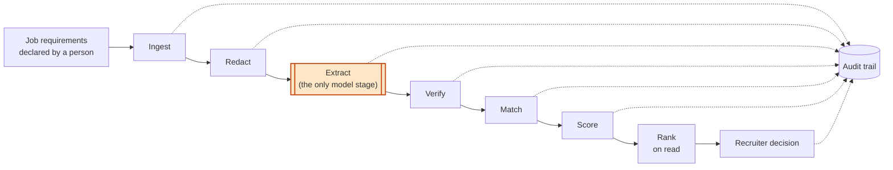
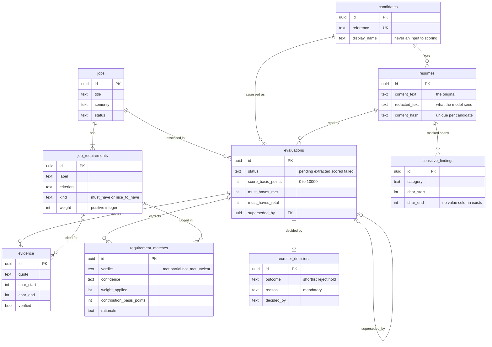
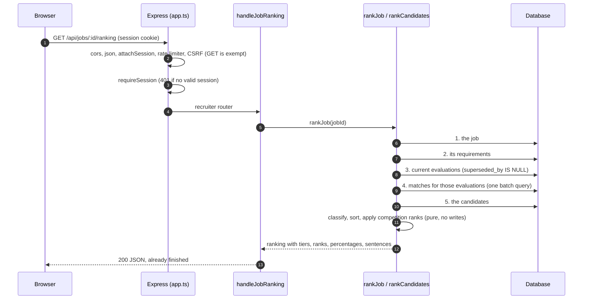
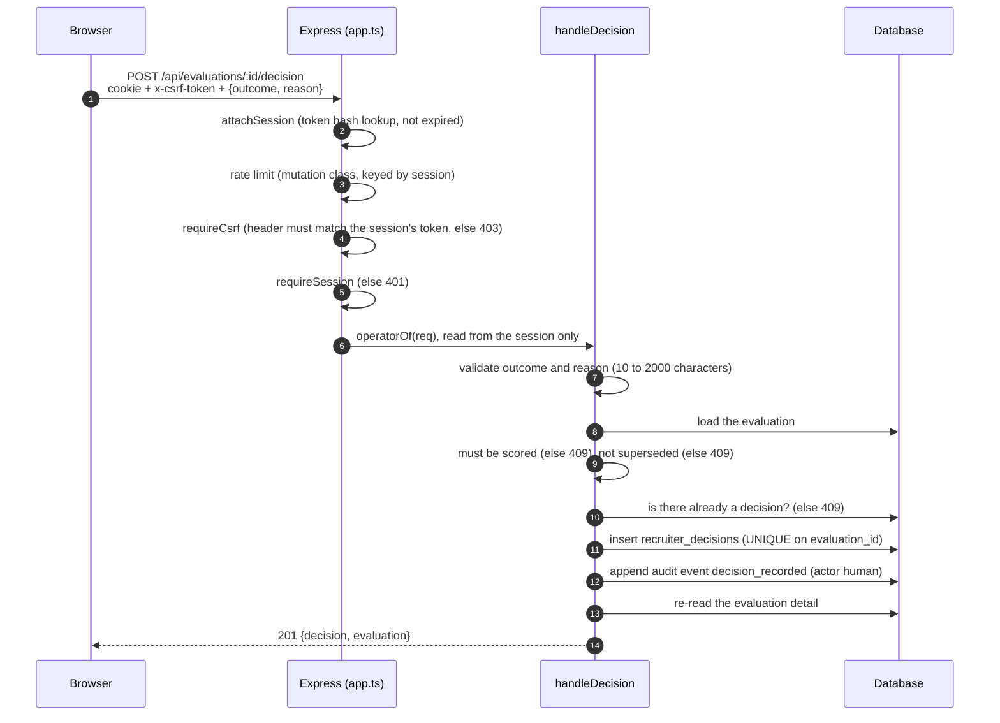

# Architecture

This document explains how Explainable ATS is built, stage by stage, and why it is built that way. The README gives the overview; this is the detail behind it.

The one idea everything follows from: **the model quotes, deterministic code judges.** A language model is used in exactly one stage, extraction, to find passages in a CV. Every stage after it is ordinary code that anyone can re-run by hand.

## Contents

1. [Components](#1-components)
2. [The pipeline, stage by stage](#2-the-pipeline-stage-by-stage)
3. [Data model](#3-data-model)
4. [Request flows](#4-request-flows)
5. [Database drivers](#5-database-drivers)
6. [LLM providers and failure](#6-llm-providers-and-failure)
7. [Two modes, one codebase](#7-two-modes-one-codebase)
8. [Design decisions](#8-design-decisions)

## 1. Components

The repository is two packages and no build step on the server.

```
server/   Node 24, TypeScript run directly by Node (type stripping), Express 5
web/      React 19, Vite, Tailwind, a small hash router
```

### Server (`server/src/`)

| Directory | Responsibility |
|---|---|
| `agent/` | The pipeline: `ingest`, `redact`, `extract`, `verifyEvidence`, `match` / `matchRules`, `score`, `rank` / `rankRules`. The business logic lives here and nowhere else. |
| `domain/` | The vocabulary. `ats.ts` declares every closed set once (verdicts, tiers, decision outcomes, audit stages) and the scoring constants. `session.ts` holds the session token helpers. |
| `adapters/llm/` | The model boundary: one `LlmProvider` interface, a deterministic `mock` and an `anthropic` adapter. |
| `db/` | The `Database` interface, the SQLite and PostgreSQL drivers, the migration runner, and one repository per aggregate under `repositories/`. |
| `handlers/` | Request logic. A handler validates input, calls the pipeline or a repository and returns `{ status, body }`. It knows nothing about Express. |
| `routes/` | Thin Express routers that read parameters and call a handler. `recruiter.ts`, `auth.ts`, `health.ts`, `demoSession.ts`. |
| `auth/` | Session cookies, the session middleware and CSRF checking. |
| `http/` | CORS and the in-memory rate limiter. |
| `config/` | `env.ts` reads and validates configuration at import time; `mode.ts` defines the two deployment modes. |
| `demo/` | The synthetic dataset, the seeder and the per-visitor in-memory sandboxes used by the demo. |
| `lib/` | Small shared pieces: errors, clock, ids, logger, log redaction, password hashing, input validation. |
| `app.ts`, `index.ts` | `createApp` assembles the app without binding a port, so tests can build it; `index.ts` is the process entry point. |

Routes stay thin on purpose. `routes/recruiter.ts` contains no decisions; `handlers/` can be tested with an in-memory database and no port.

### Web (`web/src/`)

| Path | Responsibility |
|---|---|
| `App.tsx` | Asks `GET /api/health` which mode the server is in, then hands the page to `RecruiterApp` or `DemoApp`. If the answer is missing or unknown it shows an error and a retry button. It never guesses. |
| `RecruiterApp.tsx`, `DemoApp.tsx` | One per mode. Each owns its own screens and routes. |
| `screens/` | `Login`, `Overview`, `Jobs`, `JobDetail`, `CandidateDetail`, `DemoEntry`. |
| `components/` | Shared pieces, including the evidence highlighter, the pipeline view and the audit timeline. |
| `copy.ts` | All recruiter-facing wording, in one pure module (see the [term table](../README.md#terms-and-what-the-screen-says)). The decision buttons use the code's own outcome words: Shortlist, Reject, Hold. |
| `api/client.ts` | The only place that calls `fetch`. Every failure becomes one `ApiError` shape. |
| `router.ts` | A hash router. Hash routing needs no server rewrite rule, so a URL opens correctly from any static host. |
| `demo/` | Pure builders for the demo's evidence, pipeline and timeline views. |

The browser never scores, sorts or classifies anything. The server sends finished positions, finished percentages and finished sentences, so a number is never computed in two places.

## 2. The pipeline, stage by stage



Each row below names the file, what the stage reads and writes, and what it guarantees.

| Stage | File | Reads | Writes | Guarantees |
|---|---|---|---|---|
| **Job** | `agent/ingest.ts` (`createJob`) | A person's input: title, seniority, and a list of requirements | `jobs`, `job_requirements`; audit `job_created` | A job with no requirements is refused, so nobody is ever scored out of zero. Each requirement has a label, a criterion sentence, a kind (`must_have` / `nice_to_have`) and a positive integer weight. Requirements are declared, never inferred from a job advert. |
| **Ingest** | `agent/ingest.ts` (`ingestResume`) | Plain resume text | `candidates`, `resumes` (both texts), `sensitive_findings`; audit `resume_ingested` | Empty or over-200,000-character text is refused. The redacted copy is produced before anything is stored and written with the original in one insert. The same document for the same candidate is one resume (unique on content hash). |
| **Redact** | `agent/redact.ts` | The resume text, plus the candidate's own name if known | The redacted text; one `sensitive_findings` row per masked span; audit `sensitive_attributes_masked` | Spans are replaced with `█` runs of the *same length*, so offsets are identical in both copies. Only a category and a character range are recorded, never the value. |
| **Open evaluation** | `agent/extract.ts` (`openEvaluation`) | A job and a candidate's resume | `evaluations` row in status `pending`; marks any earlier evaluation for the same job and candidate as superseded | Done in one transaction, so a current evaluation and the one it replaces can never both look current. |
| **Extract** | `agent/extract.ts` (`extractEvidence`) | The job's requirements and **only** `redacted_text` | Calls the provider; audit `extraction_recorded` | The prompt is built from the requirements and the redacted text. The original never enters the function's scope. The provider must answer through a forced tool call (`record_evidence`) against a fixed schema that has no verdict or score field. Malformed findings are dropped with a reason and audited. |
| **Verify** | `agent/verifyEvidence.ts` | Each accepted quote and the **original** `content_text` | `evidence` rows (`verified` true or false); audit `evidence_verified` and, if any were rejected, `unverifiable_evidence_rejected` | A quote counts only if it is found in the original text, character for character (whitespace differences are tolerated; case and wording are not). The model's offsets are a hint: the quote is located in the source and the stored offsets are the real ones. A quote overlapping a masked span is refused. Rejected quotes are stored unverified so a fabrication stays visible, and are never used again. The evaluation moves to `extracted`. |
| **Match** | `agent/matchRules.ts`, `agent/match.ts` | Verified evidence only | `requirement_matches` (verdict, confidence, rationale) | One verdict per requirement from term coverage (see below). No model is imported by these files. Evidence is filtered on `verified` twice: by the repository query and again inside `decideMatch`. |
| **Score** | `agent/score.ts`, `agent/match.ts` | The matches and the weights | `evaluations` (`score_basis_points`, `must_haves_met`, `must_haves_total`), in one transaction with the matches; audit `requirements_matched`, `score_computed` | Integer arithmetic in basis points (0 to 10000). Contributions sum exactly to the score. The audit payload holds every input, so the score can be recomputed from the trail alone. Status becomes `scored`. |
| **Rank** | `agent/rankRules.ts`, `agent/rank.ts` | The current evaluations and their matches | **Nothing** | Computed on every read. No ranking table, no cached order. Five queries however many candidates there are. |
| **Decide** | `handlers/evaluations.ts` (`handleDecision`) | One scored, non-superseded evaluation; the operator's session | `recruiter_decisions`; audit `decision_recorded` | A reason of at least 10 characters is mandatory. One decision per evaluation. The decider comes from the session, never from the request. |

### How matching decides a verdict

`decideMatch` takes a requirement and the verified quotes cited for it.

1. The requirement's **terms** are the significant words of its label and criterion: lower-cased, at least three characters, minus a short stop-word list, de-duplicated.
2. It joins the verified quotes, lower-cases them, and counts how many terms appear in that text (a substring test).
3. With *covered* as the share of terms found:
   - 75% or more: `met`
   - 35% or more: `partial`
   - below 35%: `not_met`
4. **No verified quote at all, or a criterion with no significant terms, is `unclear`, not `not_met`.**
5. Every verdict carries a rationale that states what was counted, for example: *"Not met. The best evidence found covers only 1 of 3 — nothing was found for "run", "scale". 1 quoted passage."*

The comparisons are integer (`covered * 100 >= terms * 75`), so there is no floating point anywhere in the path.

This is term coverage, not comprehension. It is crude on purpose, and the rationale shows exactly what it counted so a recruiter can see when it is wrong.

### How scoring works

```
score = floor( Σ (weight × verdictBasisPoints) / Σ weight )
```

with `met = 10000`, `partial = 5000`, `not_met = 0`, `unclear = 0`. The division happens once, at the end.

Each requirement's stored *contribution* is its share of that final number. Plain flooring would lose a basis point here and there, and the column would come up short of the headline. So the leftover points are handed out by largest remainder, ties broken by the requirement's own order. The contributions always add up to the score exactly.

The README has a [worked example](../README.md#scoring) you can recompute with a calculator.

### How ranking works

`classify` reads the stored must-have counts and puts each candidate in one tier:

| Tier | Rule |
|---|---|
| `qualified` | `mustHavesMet >= mustHavesTotal` |
| `gated` | At least one must-have is not `met` and was **addressed** (`partial` or `not_met`) |
| `needs_review` | Every missed must-have is `unclear`: the CV said nothing either way |
| `not_evaluated` | No evaluation, or one that was never scored |

Candidates sort by tier, then score (highest first), then must-haves met, then evaluation time, then candidate id, which is a stable but arbitrary final tie-break. Candidates who tie on tier, score and must-haves share a competition rank (1, 2, 2, 4) and are reported as tied.

A `partial` must-have counts as a failure for the gate. Only `met` clears it.

## 3. Data model

Two migrations create everything: `001_foundation.sql` (sessions) and `002_domain.sql` (the ten domain tables). The database refuses what the code must never produce: every closed set is a `CHECK` constraint, weights must be positive, scores are integers between 0 and 10000, and a requirement can be judged once per evaluation.



Two more tables sit outside that diagram:

- `audit_events`: `(correlation_id, sequence)` is unique. Events are grouped by correlation id, which is the resume's id for ingestion and redaction, and the evaluation's id for everything after. The repository exposes `append` and read methods only; there is no update or delete.
- `sessions`: the operator's sessions, keyed by the SHA-256 of the token.

Notes on the shape:

- **`evaluations` is one row per assessment**, not per person. Re-assessing a candidate opens a new row and sets `superseded_by` on the old one, which keeps its own score, matches and decision.
- **Superseded evaluations are history.** They cannot be scored or decided on, and rankings read only evaluations where `superseded_by IS NULL`.
- **`requirement_matches.weight_applied`** stores the weight as it was at scoring time, so an old explanation still adds up after the job is edited.
- **There is no ranking table.** A test asserts that none exists.

## 4. Request flows

### Reading a ranking



Five queries, however many candidates. The ranking never reads evidence, resumes or the quarantine table. Everything it needs was committed by the scorer from verified evidence.

### Recording a decision



The deciding operator is never taken from a header or the body. The score and ranking are not touched by a decision.

## 5. Database drivers

There is one `Database` interface (`db/types.ts`: `query`, `execute`, `transaction`) with two drivers:

| Driver | When | Notes |
|---|---|---|
| SQLite via Node's built-in `node:sqlite` | `DATABASE_URL` is empty | Zero dependencies. Used for local runs, every test, and the demo's in-memory sandboxes. |
| PostgreSQL via `pg` | `DATABASE_URL` is a `postgres://` or `postgresql://` URL | `pg` is imported dynamically, so a machine without a `DATABASE_URL` never loads it. |

The choice is made in `db/index.ts::createDatabase` from `DATABASE_URL` alone. There is no separate driver flag.

How one set of migrations serves both:

- The migrations are written as PostgreSQL DDL. For SQLite, `db/dialect.ts` translates a closed list of type tokens (`UUID`, `TIMESTAMPTZ`, `JSONB`, `BOOLEAN` and a few more) and one default expression. It is not a SQL translator and does not parse statements.
- Queries are written with `?` placeholders; the PostgreSQL driver converts them to `$1, $2, …`.
- Both drivers hand JSON columns back as raw text and parse them in one place (`db/rows.ts`), because `node:sqlite` and `pg` otherwise disagree about JSON scalars.
- Timestamps are ISO-8601 UTC text everywhere. Every repository takes its timestamps from an injectable clock.
- A migration is immutable once applied: its checksum is recorded and a changed file is refused.

The PostgreSQL driver asks for TLS unless the URL carries a `sslmode=` parameter. A local server without TLS needs `?sslmode=disable` on the URL.

Every automated test runs on SQLite. I also ran the PostgreSQL path by hand against a disposable PostgreSQL 17 container: migrations applied twice (the second run applied nothing), the demo dataset seeded, and the real server in `APP_MODE=app` handled sign-in, a ranking read, a candidate read, a decision (201), a second decision (409) and a too-short reason (400). There is no automated test for it.

## 6. LLM providers and failure

`adapters/llm/types.ts` defines `LlmProvider.complete(request)`, which returns structured `output`, the model name, latency and, when the provider reports it, token usage.

| Provider | Selected by | Behaviour |
|---|---|---|
| `mock` | the default | Replays registered fixtures or deterministic responder functions. Anything unregistered raises instead of inventing a reply. In the demo, a responder (`agent/mockExtractor.ts`) reads the prompt and quotes whole lines that contain the most requirement terms. It is a keyword matcher, not a model. |
| `anthropic` | `LLM_PROVIDER=anthropic` and `ANTHROPIC_API_KEY` | Uses the official SDK. Sends the redacted prompt, **forces** the `record_evidence` tool with parallel tool use disabled, and accepts exactly one well-formed tool call. |

There is no fallback between them. Asking for `anthropic` without a key stops the server at startup, rather than quietly replaying fixtures and presenting them as a real run.

The Anthropic adapter's rules:

- Hard timeout per request (`ANTHROPIC_TIMEOUT_MS`, default 60000, maximum 300000).
- Bounded retries (`ANTHROPIC_MAX_RETRIES`, default 2, maximum 5) with a doubling delay, only for transient failures: timeout, dropped connection, HTTP 408, 429 and 5xx. `Retry-After` is honoured within a cap. The SDK's own retries are switched off so there is one policy.
- A bad request, a bad key, a refusal, a truncated answer, a missing or repeated tool call, or a payload that is not a `findings` object is an `LlmError`, never an empty result.
- The model name is whatever `ANTHROPIC_MODEL` says. The adapter names no model itself. Some newer models reject a forced tool call with a 400; if the configured one does, extraction fails with the API's own message and is not retried.
- The adapter never scores, matches or ranks. Its output is a set of candidate quotes that go through the same schema check and the same verification as the mock's.

**What happens when the provider fails.** `extractEvidence` catches the failure, marks the evaluation `failed` with a safe reason, appends an `extraction_failed` audit event and raises `PROVIDER_UNAVAILABLE` (HTTP 502 if it ever reaches a route). It never turns the failure into an empty list of findings. "The model found nothing" and "the model could not be reached" are different facts, and only one of them says anything about the candidate. The provider's own error text goes to the operator log, not to the response or the audit trail.

No HTTP route runs extraction. In the real application the pipeline runs from `npm run seed:demo` and from tests; there is no upload or paste endpoint.

## 7. Two modes, one codebase

`APP_MODE` (`app` or `demo`) is read once at startup. A route that does not belong to the running mode is never registered, so it answers like any path the server has never heard of.

| | `app` (default) | `demo` |
|---|---|---|
| Routes | health, sign-in, recruiter API | health, `/api/demo/session/*` |
| Sign-in | required for everything but health | none, and no sign-in route exists |
| Database | the canonical database, migrated before start | none; each visitor gets a private in-memory SQLite database |
| Model provider | `mock` or `anthropic` | `mock` only |

The demo refuses to start if `DATABASE_URL`, `OPERATOR_PASSWORD_HASH` or `ANTHROPIC_API_KEY` is set, if `LLM_PROVIDER` is anything but `mock`, or if `SQLITE_PATH` is anything but `:memory:`. It names the variable and never prints a value. `createApp` also refuses to build a demo that is handed a database.

A demo session is a private in-memory database seeded by the same code as the canonical seeder (`demo/seed.ts`) over the fixed dataset, with a fixed clock and sequential ids, so every session starts identical. It is named by an opaque `ats_demo` cookie (32 random bytes, stored server-side as a SHA-256). Sessions lapse after two hours without use and at most 100 exist at once; the least recently used is evicted. Starting a session is rate limited to 10 per minute because it builds a database.

## 8. Design decisions

Each decision below: what I chose, why, and what it costs.

### The model doesn't score

- **Decision.** The model returns quotes and nothing else. The tool schema has no verdict and no number.
- **Why.** A score a model produced can't be reproduced, can't be explained beyond "it said so", and can't be defended to a candidate who asks why they were screened out. A verdict from code can be recomputed by hand from stored evidence.
- **Trade-off.** The judging rules are crude. Term coverage can't tell that "led a team of five" supports "has leadership experience" unless the words overlap. I accept that, and the rationale states exactly what was counted so a person can overrule it.

### Redaction keeps the same length

- **Decision.** Each masked span is replaced by `█` characters of exactly the same length.
- **Why.** The redacted and original texts then share one set of character offsets. An offset the model returns against the redacted text indexes the original directly, with no mapping table and no off-by-one. Shortening the text, for example to `[NAME]`, would shift every later offset and evidence would quote the right words from the wrong place.
- **Trade-off.** The length of a removed value stays visible. And redaction is pattern-based: labelled fields, emails and phone numbers, plus names the caller supplies. It is not a general PII scrubber, and unlabelled personal details can get through.

### Integer basis points, not floats

- **Decision.** Scores are integers from 0 to 10000. Weights are positive integers. The division happens once, at the end, with `floor`.
- **Why.** A float can differ in its last digits across machines, and `pg` returns `NUMERIC` as a string, so a weight of `"3"` would concatenate instead of add. A recruiter has to be able to redo the arithmetic with a pencil.
- **Trade-off.** Scores are rounded down, and screens round to whole percent for display, so two different scores can show the same percentage. The stored value is always the exact one.

### Ranking is computed on read

- **Decision.** There is no ranking table and no stored position.
- **Why.** A stored ranking is a second source of truth that drifts the moment one evaluation is superseded and the other isn't. The list would disagree with the page it links to.
- **Trade-off.** Every read recomputes. It costs five queries and a sort, which is fine here. At large scale you would materialise or cache it, and take on the invalidation problem.

### A missed must-have changes placement, not the score

- **Decision.** The score is the plain weighted average. A missed must-have is counted (`mustHavesMet` / `mustHavesTotal`) and moves the candidate to a lower tier.
- **Why.** Capping the score would break the identity that the contributions sum to the total, and the arithmetic would stop being checkable. Placement is a separate question, answered from the stored counts.
- **Trade-off.** A higher score can sit below a lower one. The ranking prints a sentence for it ("Placed below every candidate who meets all of them, however high that score is — the score itself is unchanged"). In the demo dataset, Devi and Marcus both score 71% and Devi ranks above Marcus. A `partial` must-have also counts as a failure for the gate; only `met` clears it.

### Unverified quotes are stored but never used

- **Decision.** A quote the verifier rejects is saved with `verified = false` and nothing downstream reads it.
- **Why.** If a fabrication left no trace nobody could learn from it. The audit trail shows how many were rejected and why. The recruiter's screen never receives them.
- **Trade-off.** The danger is a future query that forgets the filter. So there are two locks: the repository's `listVerifiedForEvaluation`, and a second `verified` check inside `decideMatch`. Tests cover both.

### No semantic matching

- **Decision.** There are no embeddings, no vector search and no similarity scores anywhere in the codebase.
- **Why.** A similarity number is unreproducible across model versions and can't be explained to the person it affects. Rules over verified quotes can be re-run next year and give the same answer.
- **Trade-off.** Recall. Paraphrase is missed, and word forms count as different terms ("mentored" and "mentoring" are two terms). A missed passage becomes `unclear`, which sends the candidate to a human rather than rejecting them, but it still costs coverage.

### `unclear` is not `not_met`

- **Decision.** "The CV says nothing about this" and "the CV says something that falls short" are separate verdicts, and separate tiers (`needs_review` and `gated`).
- **Why.** Reporting an absence of evidence as evidence of absence is how a good candidate gets silently filtered out.
- **Trade-off.** More states to explain on screen, which is why `web/src/copy.ts` exists.

### The demo is a separate mode, not a flag

- **Decision.** The public demo is `APP_MODE=demo`, where recruiter routes and the canonical database don't exist at all, rather than a read-only window onto real data.
- **Why.** "Nothing to reach" is a stronger guarantee than "a check that refuses". There is no handler to misconfigure and no credential to leak.
- **Trade-off.** Two sets of routes and screens to keep consistent, which is what the parity test and the mode tests are for.
